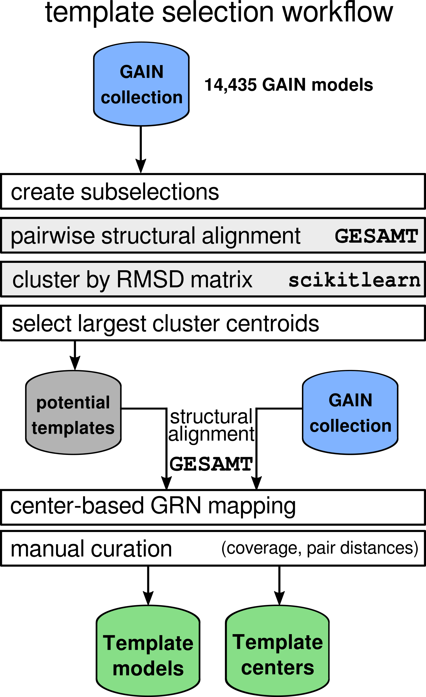
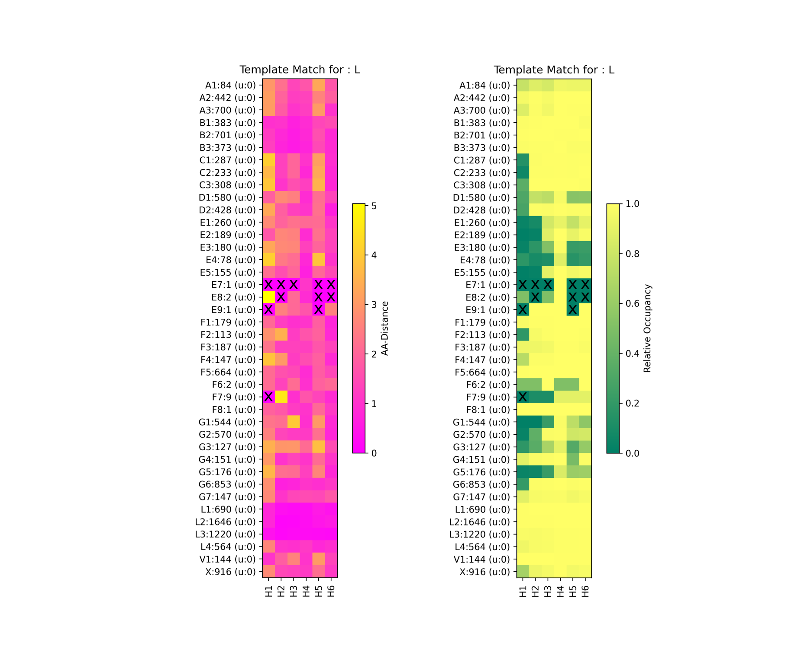

GAIN-GRN: A Generic Residue Numbering Scheme for GPCR Autoproteolysis Inducing (GAIN) Domains
===================================================================================

This documentation contains explanations for the contents and usage of the Jupyter notebooks and scripts contained in the package.

|JLogo| `1 Filter Stage <https://github.com/FloSeu/GAIN-GRN/blob/main/gaingrn/1_filter_stage.ipynb>`_
=====================================================================================================

Here, the GAIN domain 3D models and their secondary structure data evaluated by `STRIDE <https://webclu.bio.wzw.tum.de/stride/>`_ are filtered according to GAIN domain detection criteria:
   
   - Presence of a 20+ resiude Subdomain A
   - Presence of a "GPS" or analogous stretch of residues between the last two beta-strands

The valid GAIN domains are collected into a *GainCollection* object containing their N-, C- and subdomain boundary as well as information about their secondary structural elements.
It is stored in a PKL file.

A similar procedure is done for `PKD1/PKD1L1 GAIN domain models <gaingrn/pkd_gain/pkd_gain_processing.iypnb>`_.

|JLogo| `2 Template Selection <https://github.com/FloSeu/GAIN-GRN/blob/main/gaingrn/2_template_selection.ipynb>`_
=================================================================================================================

Two sets of templates exist for each respective subdomain to account for their different degrees of conservation. The template selection and following curation workflow look as follows:

Subselections are created based on manually defined criteria (Here, we use aGPCR homologs, i. e. "ADGRA2") and each subselection is aligned to itself via GESAMT, creating an n² RMSD matrix.
The subselection is then assessed `agglomerative clustering < https://scikit-learn.org/stable/modules/generated/sklearn.cluster.AgglomerativeClustering.html>`_ to see the variance within the subselection.
If the variance is sufficiently small and coverage is decent, the centroid of the largest cluster is selected as a *potential template*. Every *potential template* is pairwise-matched against the whole 
*valid collection* and MSAs are created for each segment by stacking the pairwise residue matches. From these MSAs, the segment center can be extracted by finding the highest occupancy and conservation
in the segment resdiues.

|JLogo| `3 Template Curation <https://github.com/FloSeu/GAIN-GRN/blob/main/gaingrn/3_template_curation.ipynb>`_
===============================================================================================================

The previously defined *potential templates* with their matches are assessed for coverage. For this, evaluate each recpeptor subselectionand use the respective sets of pairwise alignments to the 
*potential template* to assess:
   
   - the fraction of the models that have matches with the segment and segment center
   - the distance of the pairwise segment center match

Not all GAIN models have for example six helices in Subdomain A, evidence by the **X** markers ni the figure. Assessing all templates, each receptor homolog has a template assigned for each subdomain that
covers all segments with sufficient quality (see in `template_data.json <data/template_data.json>`_).

|JLogo| `4 Assign the GAIN-GRN <https://github.com/FloSeu/GAIN-GRN/blob/main/gaingrn/4_assign_gaingrn.ipynb>`_
==============================================================================================================

After having the template PDB files and the respective information on segments and segment centers, we can now create a full GRN assignment of all GAIN domain models. In this notebook, GAIN-GRN is
assigned to specific *GainDomain* objects or to a whole *GainCollection*. For faster assignment, a parallelized version is available: |PLogo| `run_indexing.py <run_indexing.py>`_. The full set of alignment data
is stored in a pickle file (`data/stal_indexing.pkl <data/stal_indeixng.pkl>`_)

|JLogo| `5 GAIN-GRN Dataset Statistics and Analysis <https://github.com/FloSeu/GAIN-GRN/blob/main/gaingrn/5_gaingrn_statistics.ipynb>`_
=======================================================================================================================================

The complete set of GRN assignments can now be used to statistically evaluate the GAIN domain model dataset. Here, conservation per residue and segment occupation are assessed (see Figure 2 and Supp. Fig. 1).

|JLogo| `6 Cancer Mutation Analysis <https://github.com/FloSeu/GAIN-GRN/blob/main/gaingrn/6_cancer_analysis.ipynb>`_
====================================================================================================================

As an application for the GAIN-GRN, the natural variant and cancer mutation data for the human aGPCR can be mapped to their respective GRN labels. This enables the calculation of a cancer enrichment score
analogous to Wright et al.[1], enabling the identification of hotspots of cancer-enriched residues (see Figure 5, Supp. Fig. 2). Here, also tools are provided to extract the full variant/mutation information
for every labeled position (which receptor, which substitution, which potential impact) for the individual assessment of residues for designing wet-lab experiments. 

|JLogo| `Dynamic GAIN-GRN Assignment <https://github.com/FloSeu/GAIN-GRN/blob/main/gaingrn/dynamic_gain_grn.ipynb>`_
====================================================================================================================

Here, we provide a complete workflow to dynamically assign the GAIN-GRN to any GAIN-domain containing protein. By just providing the UniProtKB identifier, the `UniProt <https://www.uniprot.org>`_ 
information and the 3D model from `AlphaFoldDB <https://alphafold.ebi.ac.uk>`_ are retrieved and automatically assessed. The notebook guides the user through the GAIN-GRN assignment process. This is
especially useful for distantly related proteins, i.e. PKD1/PKD1L1 proteins or invertebrate aGPCRs.

Please also refer to the `FAQ <FAQ.rst>`_ for further info.

 .. |PLogo| image:: 
   https://github.com/FloSeu/GAIN-GRN/blob/main/figures/plogo.png
   :height: 2ex
   :class: no-scaled-link

 .. |JLogo| image:: 
   https://github.com/FloSeu/GAIN-GRN/blob/main/figures/jlogo.png
   :height: 2ex
   :class: no-scaled-link

 .. |Python| image::
    https://github.com/FloSeu/GAIN-GRN/blob/main/figures/python39.svg

 .. |Jupyter| image::
    https://github.com/FloSeu/GAIN-GRN/blob/main/figures/jupyterlab.svg

 .. |License| image::
    https://github.com/FloSeu/GAIN-GRN/blob/main/figures/gpl3.svg
    :target: https://github.com/FloSeu/GAIN-GRN/LICENSE.txt
 
 .. |DOI| image::
    https://img.shields.io/badge/DOI-10.21203%2Frs.3.rs--4761600%2Fv1-blue
    :target: https://doi.org/10.21203/rs.3.rs-4761600/v1

